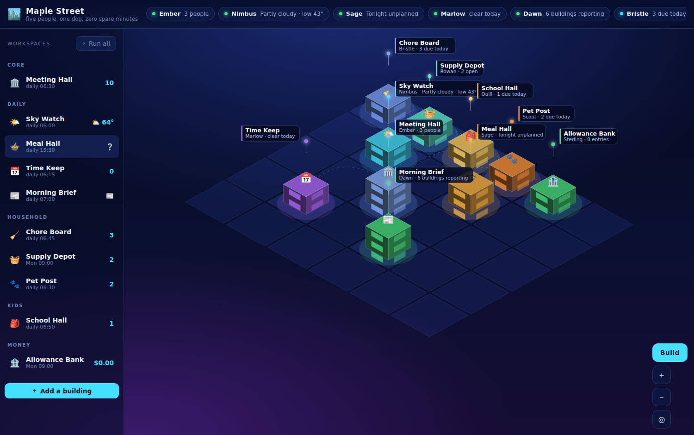
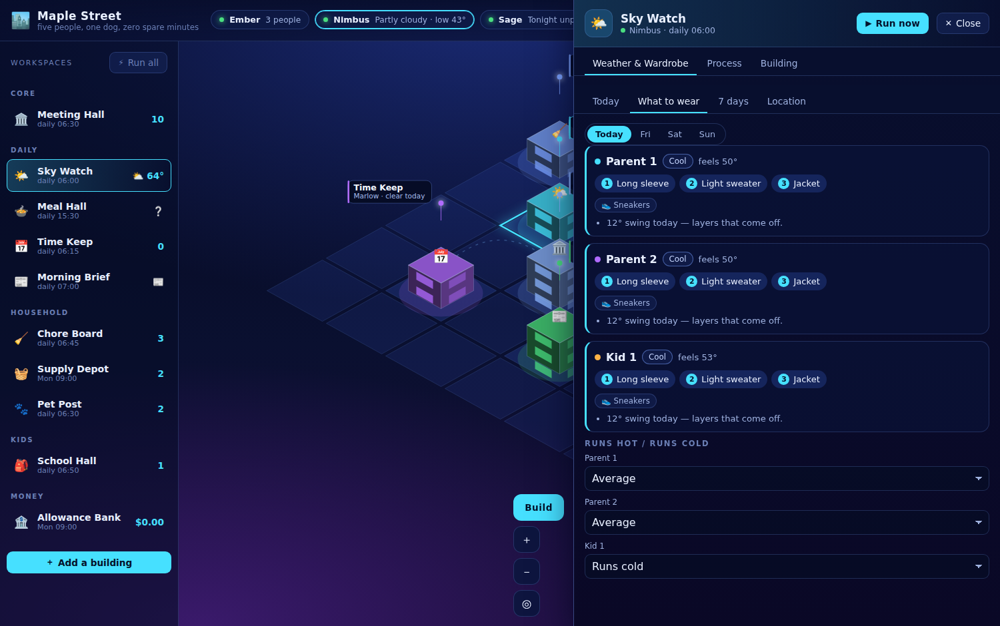
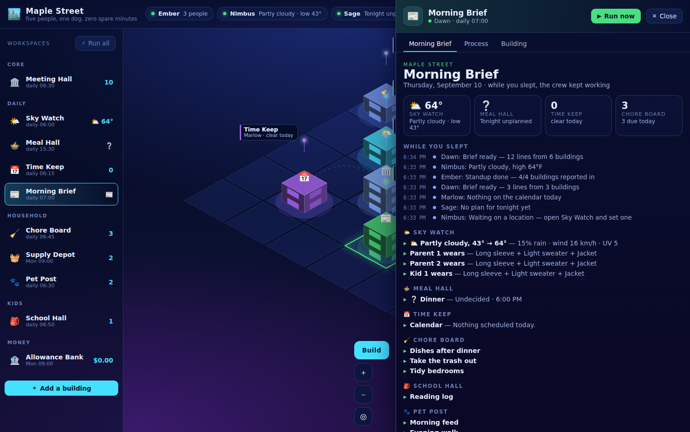

# Family City

A city you build for your household. Every building is one job — the weather
and what to wear, tonight's dinner, the family calendar, the chore board — and
every building runs its own scheduled process. Open the map in the morning and
the city has already done its overnight work.

No build step, no server, no accounts, no keys. It is plain HTML, CSS and ES
modules, and everything you enter stays in your browser's `localStorage`.



## Run it

```sh
cd family-city
python3 -m http.server 8080
# then open http://localhost:8080
```

Any static server works. `file://` will **not** — ES modules need a real HTTP
origin. To put it on a wall tablet, host the folder anywhere static (GitHub
Pages, Netlify, a Raspberry Pi on the LAN) and open it in kiosk mode.

## What's in the city

Five buildings exist on first boot. Everything else you add from **Build**.

| Building | What it does |
| --- | --- |
| 🏛️ **Meeting Hall** | The household roster, city settings, the whole activity feed, JSON export/import. |
| 🌤️ **Weather & Wardrobe** | 7-day forecast, hourly strip, air quality and pollen, US government alerts, and a **what-to-wear call for each person** that accounts for who runs hot and who runs cold. |
| 🍲 **Meal Hall** | The week's dinner plan (cook / takeout / out / leftovers), recipe search, a **takeout order roll-up** everyone fills in, and a one-tap push of recipe ingredients to the shopping list. |
| 📅 **Family Calendar** | Month grid and agenda, per-person colors, repeats, overlap detection, `.ics` import and export. |
| 📰 **Morning Brief** | One page assembled from every other building, plus what the agents did while you slept. Printable. |





Available from the catalog: 🧹 Chore Board (points and streaks), 🧺 Supply Depot,
🎒 School Hall, 💊 Medicine Cabinet, 🏦 Allowance Bank (running balance per kid),
🧳 Trip Lodge (packing lists), 🐾 Pet Post, 🔧 Maintenance Yard, 🎯 Habit Track,
🌱 Garden Plot, 🎬 Watch & Read, 🎁 Wish List, 🚨 Emergency Post, 📌 Message Board,
and 🧱 Blank Lot for anything with no home yet.

## How a building works

Click any building on the map — or in the left rail — to open its panel. Three
tabs:

- **its own screen** — the calendar, the meal week, the chore list;
- **Process** — what job it runs on its own, and when. `manual`, `every N
  minutes`, `daily at`, `weekdays at`, or `weekly on`. Each building type ships
  several jobs; the Process tab lists every one with a Run button;
- **Building** — rename it, rename its agent, recolor it, move it to another
  lot, or demolish it.

The scheduler ticks every 30 seconds and **catches up**: if Sky Watch is set to
6:00am and you open the app at 9:00, it still runs. That is what fills the
"while you slept" section of the Morning Brief.

Buildings talk to each other. Meal Hall pushes ingredients into the Supply
Depot and dinners into the Family Calendar; the Morning Brief reads a line from
everything. If a building isn't in the city, the hand-off just says so.

## Data sources

All free, all key-free, all called straight from the browser:

- [Open-Meteo](https://open-meteo.com/) — forecast, geocoding, and
  [air quality + pollen](https://open-meteo.com/en/docs/air-quality-api).
- [api.weather.gov](https://www.weather.gov/documentation) — active National
  Weather Service alerts. US only; elsewhere it returns nothing and the panel
  simply omits the section.
- [TheMealDB](https://www.themealdb.com/api.php) — recipe search and
  ingredients, v1 test key.

Nothing else leaves the machine. There is no analytics, no account, no sync.
The flip side: **your city lives in one browser profile.** Meeting Hall →
Backup → *Download city JSON* is the only backup there is.

## Adding your own building

Two ways, depending on how much the building needs.

### A board-style building (a list with owners, dates, repeats, points)

One entry in `js/registry.js`. That is the whole job:

```js
const readingLog = makeListModule({
  id: 'reading',
  label: 'Reading Log',
  icon: '📚',
  category: 'Kids',
  blurb: 'Minutes read per night, per kid.',
  defaultAgent: 'Page',
  accent: '#f59e0b',
  itemNoun: 'entry',
  fields: { points: true, time: true },
  categories: ['Fiction', 'Nonfiction', 'School'],
  defaultProcess: { mode: 'daily', at: '19:30', action: 'roll' },
  seeds: [{ title: '20 minutes', repeat: 'weekdays', points: 5 }],
});
```

Then add it to the `MODULES` list at the bottom of the same file. It gets the
add/edit/complete UI, repeats, streaks, per-person point tallies, the three
standard jobs (`roll`, `digest`, `clearDone`), a ticker summary, and a line in
the Morning Brief — for free.

### A building with its own screens

Write `js/modules/<name>.js` and export one object:

```js
export default {
  id: 'commute',
  label: 'Commute Watch',
  icon: '🚗',
  category: 'Daily',
  blurb: 'How long the school run will take this morning.',
  defaultAgent: 'Dash',
  accent: '#38bdf8',
  height: 1.1,                                   // how tall it stands on the map
  defaultProcess: { mode: 'weekdays', at: '07:10', action: 'check' },

  actions: {
    check: {
      label: 'Check the roads',
      description: 'Shown in the Process tab.',
      async run(ctx) {
        ctx.setData((d) => { d.lastMinutes = 24; });
        return '24 minutes, 6 over normal';      // the string lands in the feed
      },
    },
  },

  summary(ctx) { return { metric: '24m', line: 'school run' }; },  // ticker + rail
  brief(ctx)   { return [{ title: 'School run', detail: '24 minutes' }]; },
  render(ctx)  { return someElement; },           // the panel body
};
```

Import it in `js/registry.js` and add it to `MODULES`. Every method receives the
same `ctx`, documented in full at the top of `js/engine.js`:

| | |
| --- | --- |
| `ctx.data` / `ctx.setData(fn)` | this building's own persisted bag |
| `ctx.state` / `ctx.update(fn)` | the rest of the city |
| `ctx.log(msg)` | write to the activity feed as this agent |
| `ctx.run(id)` / `ctx.runAll()` | fire actions |
| `ctx.firstOfType(t)`, `ctx.dataOf(id)`, `ctx.setDataOf(id, fn)` | talk to other buildings |
| `ctx.collectBriefs()`, `ctx.summaryOf(b)` | read what everyone else is reporting |

## Layout of the code

```
index.html          the shell
styles.css          one stylesheet, tokens at the top
js/main.js          rail, ticker, add-a-building flow, wiring
js/city.js          the isometric SVG map
js/panel.js         the slide-over: module tab, Process tab, Building tab
js/engine.js        ctx, running actions, rolling up summaries
js/scheduler.js     when a process is due (with catch-up)
js/registry.js      the building catalog — start here to add one
js/store.js         state + localStorage
js/api.js           the three outside data sources
js/ui.js            shared widgets
js/util.js          DOM and date helpers
js/modules/         one file per building type
```

## Ideas worth building next

Kept here so the list isn't lost. Roughly in order of how often families ask
for them:

- **Commute / school-run times** — needs a routing key (Google, Mapbox, TomTom),
  so it was left out of a key-free build.
- **Chore → allowance payout** — Chore Board points post automatically into the
  Allowance Bank each Friday.
- **Photo of the day** — a rotating family photo on the map background.
- **Shared voice inbox** — text captured on a phone lands in the Message Board.
- **School lunch menu** — many districts publish a Nutrislice/Titan JSON feed;
  a School Hall job could pull the week and put it beside the dinner plan.
- **Read-only wall mode** — a full-screen rotation of Brief → Calendar → Chores
  for a kitchen tablet, no editing.
- **Push reminders** — Notification API for the order-by time, medication doses,
  and the leave-the-house alarm.
- **Two-way calendar sync** — `.ics` import is one-shot today; a subscribed URL
  refreshed nightly would keep school calendars live (needs a CORS-friendly
  proxy, which is why it isn't here yet).
- **Multi-device sync** — the honest options are a small self-hosted API or a
  Firebase/Supabase project; both mean an account, which this build avoids.
- **Guest / sitter view** — a share link exposing only Emergency Post, tonight's
  dinner, and the day's calendar.
- **Seasonal buildings** — a Holiday Lodge or Garden Plot that shows up in
  season and hides itself the rest of the year.

## Checking it still works

There is one test — a browser run with the three outside APIs stubbed, so it
works offline and asserts on fixed numbers. Playwright is the only dependency
in the whole project and only this file needs it:

```sh
python3 -m http.server 8080 &
npm install playwright
node test/browser-check.mjs      # BASE_URL=… to point elsewhere
```

It walks the weather panel, the wardrobe rules on a freezing day, recipe search,
the takeout order sheet, the ingredients → Supply Depot hand-off, the Morning
Brief, and an `.ics` import, then fails on any console error.

## Accessibility and browser notes

Buildings and empty lots on the map are real focusable buttons, so the city is
navigable by keyboard. `Esc` closes the panel or cancels placement. The layout
works down to 390px wide, and `prefers-reduced-motion` turns the animation off.
Printing the Morning Brief prints just the brief.
